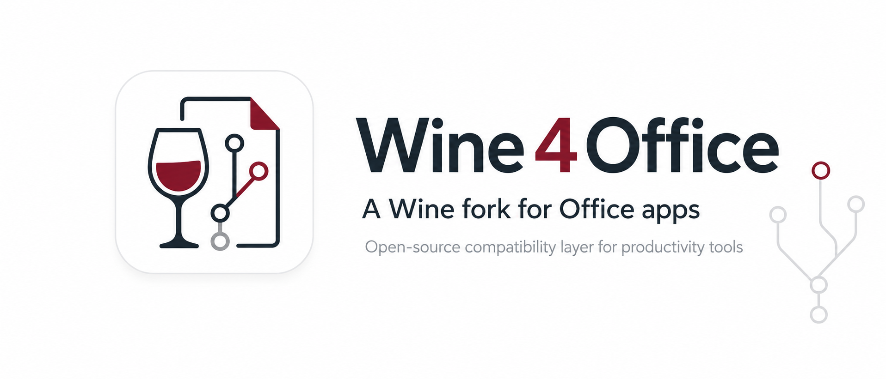

<p align="center">
  
</p>

# Wine4Office 🍷📎

**Run modern Microsoft Office on Linux without a Windows VM.**


> **AI disclosure:** Every Wine4Office investigation, code change, test, and
> document was produced with AI, primarily **ChatGPT-5.6-sol** and
> **Grok 4.5**. I directed and tested the work, but **I do not know C** and
> cannot independently audit the C/C++ code.

---

## Current Status

| App | Status | Notes |
|-----|--------|-------|
| **Word** | ✅ **Great** | Create, edit, save, sign in, updates, RTL languages, PDF export—all smooth |
| **Excel** | ✅ **Pretty Good** | Formulas, charts, CSV, print/PDF work. VBA untested |
| **Teams** | ⚠️ **Initial Support** | Chat, notifications, audio/video calls, and screen sharing work. Expect rough edges |
| **PowerPoint** | ⚠️ **Opens** | Not functionally tested (slides might slide, might not) |
| **Outlook** | ❌ **Nope** | Still in the "we've heard of email" phase |

**Tested on:** 7th & 12th-gen Intel | **License tested:** Microsoft 365 ProPlus Subscription

---

## Quick Start (The Easy Way)

Don't want to wrestle with builds? Use the **Wine4Office Manager**:

```sh
curl -fsSL https://github.com/ttv20/wine4office/releases/latest/download/install.sh | bash
```

It installs `Wine4OfficeManager` in `~/.local/bin`, creates the application-menu
shortcut, and asks whether to launch **Wine4Office Manager** immediately
(default: Yes). The default Wine environment remains `~/.wine4office`.

To install an exact published release instead of the latest stable release:

```sh
curl -fsSL https://github.com/ttv20/wine4office/releases/latest/download/install.sh | \
  bash -s -- --tag wine4office-v0.1.10
```

The installer asks before closing an active Wine4Office Manager or Wine
session. For unattended updates, pass `--force` to close those processes
without prompting (and force-stop them only if graceful shutdown times out).

### Graphics

Office draws with Direct3D 10/11. Wine4Office uses **DXVK 3.1.1** for this by
default: it translates Direct3D to Vulkan and ships inside the Wine4Office
runner. DXVK needs a GPU and a recent driver with **Vulkan 1.3** and the
extensions DXVK requires (current Mesa or NVIDIA drivers). The Manager checks this
once per driver change; without Vulkan 1.3 it keeps Wine's built-in renderer,
WineD3D, and shows the reason next to the Direct3D setting (**Check again**
repeats the check, for example after a driver update).

The WebView2 component (used by new Outlook) always stays on WineD3D, because
DXVK 3.1.1 does not implement the composition swapchains it needs.

To switch, open **Environment → Graphics backend** in the Manager and choose
**DXVK (recommended)**, **OpenGL**, or **Vulkan (WineD3D)**, then **Stop Wine
and apply**.

---

## Build It Yourself

```bash
git clone <repo>
mkdir build && cd build
../wine4office/configure --enable-archs=i386,x86_64
make -j$(nproc)
sudo make install
```

Full dependencies: [WineHQ Build Guide](https://gitlab.winehq.org/wine/wine/-/wikis/Building-Wine)

For Teams and other WebView-based Office apps, verify that configure detects
FreeType, Fontconfig, GnuTLS, and D-Bus. Disabling them causes missing text,
failed secure content, or broken desktop integration.

---

## Support this project ☕

Wine4Office is a solo, spare-time experiment involving a lot of AI tokens,
test installs, and broken prefixes. If it saved you a Windows VM, consider
buying me some tokens:

**[☕ Buy me tokens on Ko-fi](https://ko-fi.com/W1L423LQH7)**

---

## Why Not WineHQ?

WineHQ's Clean Room Guidelines ban LLM-generated code. This whole thing is AI soup, so it can't be upstreamed. It's a fork, not a patchset.

---

## Credits

DirectComposition research and selected compatibility code were adapted from
[Giang Nguyen's `giang17/wine` D2D1/DComp work](https://github.com/giang17/wine),
licensed under the GNU LGPL 2.1 or later. Wine4Office retains its native
Wayland/XWayland composition and input architecture rather than importing the
fork's X11/BitBlt presentation backend.

---

*Wine4Office is not affiliated with WineHQ or Microsoft. All trademarks belong to their respective corporate overlords.*
